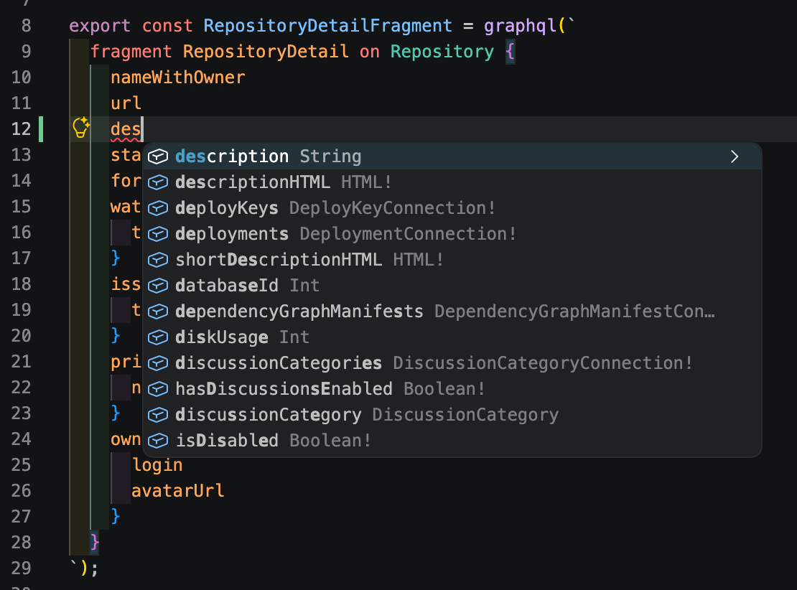

# 課題用アプリ

[Next.js](https://nextjs.org) (App Router) ベースの課題用アプリです。

このアプリは GitHub API を用いて、リポジトリを検索、表示するアプリです。

## 初期設定

このプロジェクトは [mise](https://mise.jdx.dev) でツール（Node.js / pnpm / prek）のバージョンを管理しています。

```bash
# https://github.com/settings/personal-access-tokens
# Fine-grained personal access tokens を作成する
# 権限は Repository access : Public repositories のみで OK
cp .env.sample .env.local
# 作成したトークンを .env.local の GITHUB_API_TOKEN に設定する

# Node.js と pnpm の設定
mise install
# Git Hooks の設定
prek install
```

## 開発

```bash
pnpm install
# 開発サーバー起動
pnpm dev # http://localhost:3000
```

## GraphQL を変更する場合

GraphQL ドキュメント (クエリ・フラグメント) を変更したときは、型を再生成する必要があります。生成物（`src/lib/gql/`）はコミットされているため、ドキュメントを変更しない限り実行は不要です。

```bash
# GitHub の公開 GraphQL スキーマを取得 (初回のみ必要)
mise run download-schema
# GraphQL ドキュメントから型を再生成 (--watch で変更を監視)
pnpm codegen
```

### VSCodeでの入力補完

`mise run download-schema` で `schema.docs.graphql` を取得しておくと、推奨拡張の `graphql.vscode-graphql` が `graphql.config.ts` 経由でそれを読み込み、GraphQL クエリ編集時に入力補完が効きます



入力補完が出ない場合は、コマンドパレット（macOS: `Shift + Command + P` / Windows・Linux: `Ctrl + Shift + P`）で `GraphQL: Manual Restart`（`vscode-graphql.restart`）を実行して GraphQL サーバーを再起動してください。
